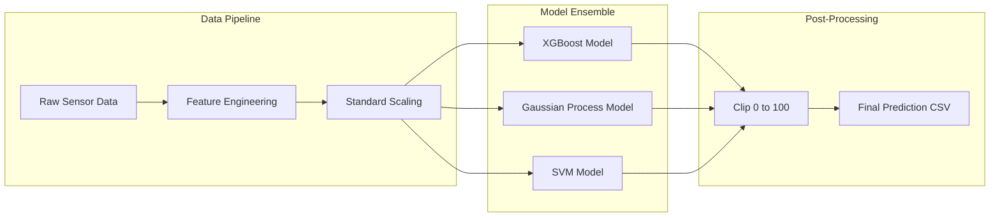

# 🏗️ Solution Architecture

This document outlines the end-to-end architecture used by **Team QuarterCodes** for predicting the overall yield of a continuous flow reactor.

---

## 1. High-Level Pipeline

The pipeline is split into three main phases:

1.  **Data Ingestion & Feature Engineering**
2.  **Surrogate Model Training**
3.  **Physical Constraint Enforcement**



---

## 2. Feature Engineering

We don't just feed raw data to the model. We explicitly model the physics of the reactor:

### A. Residence Time Proxy

The amount of time the reactant spends in the reactor is crucial for the reaction to progress.

- **Formula:** `residence_proxy = length_m / flow_rate_L_min`
- **Physical Meaning:** Represents $V/Q$ (Volume over Flow Rate), heavily dictating the conversion rate.

### B. Mean Reactor Temperature

Reactions are exponentially sensitive to temperature (Arrhenius Equation).

- **Formula:** `mean_T = (inlet_temperature_K + jacket_temperature_K) / 2`
- **Physical Meaning:** Gives the model a baseline internal energy metric instead of forcing it to learn the relationship between inlet and jacket separately.

---

## 3. Model Selection Strategy

We employed multiple surrogate models to balance accuracy with physical interpretability:

### 🏆 Model 1: XGBoost (Primary for Accuracy)

- **Role:** The workhorse for Phase 1 leaderboard ranking.
- **Strengths:** Handles non-linear interactions exceptionally well. By forcing `max_depth=3`, we prevent it from memorizing noise (overfitting) and force it to find general chemical trends.

### 🔬 Model 2: Gaussian Process Regression (GPR)

- **Role:** The "Secret Weapon" for the Phase 2 pitch.
- **Strengths:** Uses a `Matern + WhiteKernel` approach to provide **uncertainty bounds** (standard deviation). Instead of just predicting "60% yield", it predicts "60% yield ± 2%", giving engineers a measure of trust in the prediction.

### 🛡️ Model 3: Support Vector Machine (SVM)

- **Role:** A baseline robust model under concurrent development by teammates.
- **Strengths:** Effective in high-dimensional spaces and robust against outliers when scaled properly.

---

## 4. Constraint Enforcement

Machine learning models do not inherently understand chemistry. A model might predict a yield of `-5%` or `105%`, which is physically impossible.

To guarantee physically sound submissions, all predictions pass through a hard constraint filter:

```python
y_final = numpy.clip(y_predicted, 0, 100)
```

This ensures our outputs strictly obey the laws of conservation of mass.
